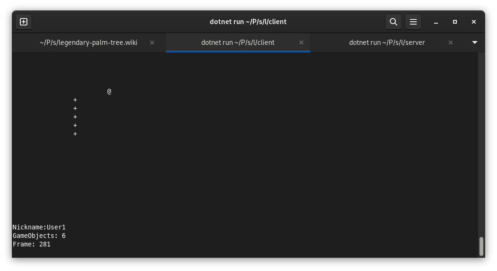

# Игровая платформа LPT

Данное решение разработано в рамках учебного проекта с целью изучения процессов разработки качественного программного обеспечения.

Решение спроектировано с использованием клиент-серверного архитектурного шаблона.

Клиент-серверная архитектура - это вычислительная или сетевая архитектура, в которой задания или сетевая нагрузка распределены между поставщиками услуг, называемыми серверами, и заказчиками услуг, называемыми клиентами. В этой архитектуре программы-серверы ожидают запросы от клиентских программ и предоставляют им свои ресурсы в виде данных или сервисных функций. Одна программа-сервер может обслуживать множество клиентских программ, что делает необходимым размещение ее на специально выделенной вычислительной машине с высокой производительностью.

[Клиентская часть](Client.md)

[Серверная часть](Server/0-Server.md)
